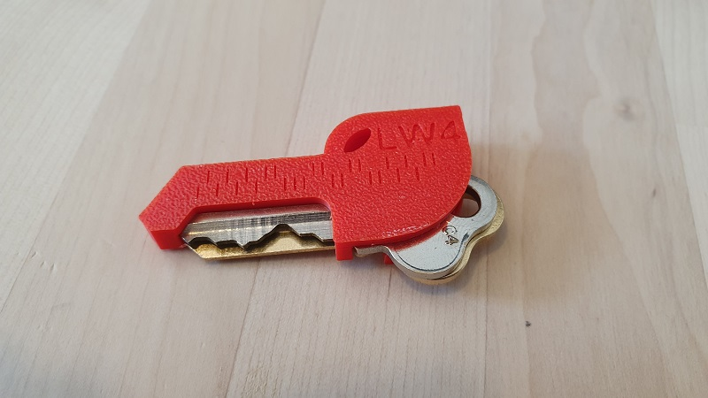
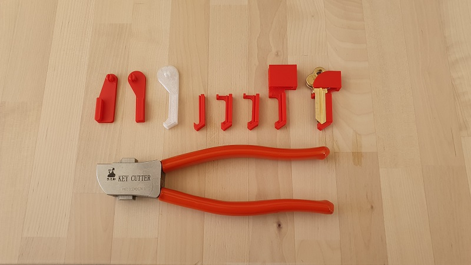
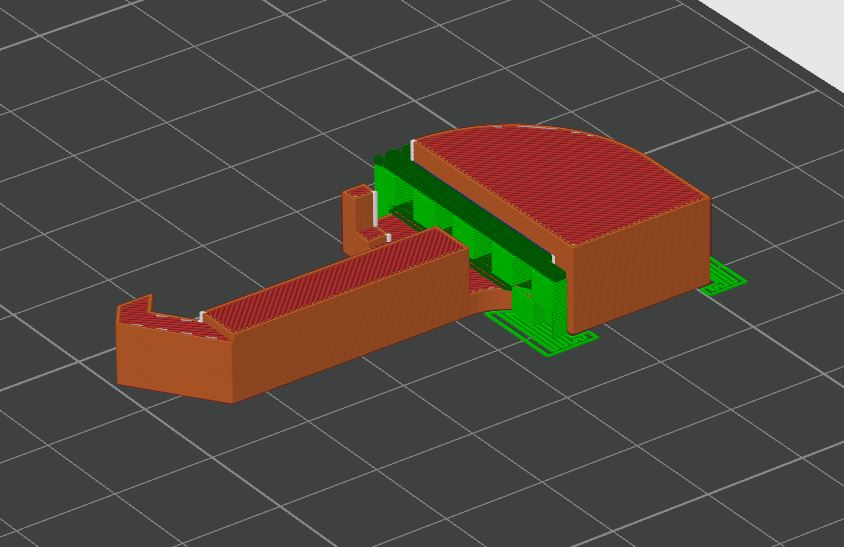

# Falcon - Lishi key duplication grip

A simple printable gripper for duplicating standard Australian Lockwood 5-pin keys (and others to come) in the Lishi pliers.

The lockwood LW4 example:

A pic of some of the development process:

## Printing

These can be printed on a 0.4mm nozzle, and I recommend this orientation:

