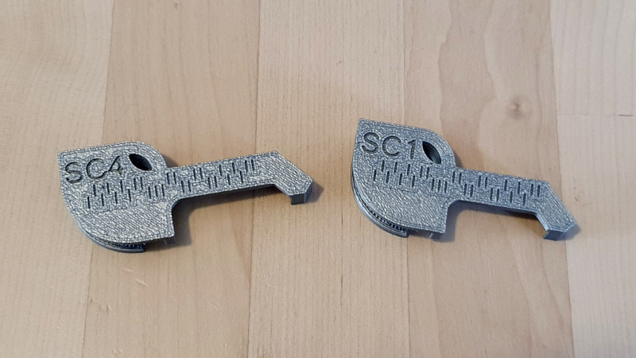

# Falcon - Lishi key duplication grip

Simple 3D-printable grippers for duplicating standard Australian Lockwood and USA Schlage 5 and 6-pin keys using Lishi pliers.

The LW4 (5 pin Lockwood) version, with key and blank fitted:

The LW4 and LW5 (6 pin Lockwood) versions:

The SC4 (6 pin Schlage) and SC1 (5 pin Schlage) version:

A video of the LW5 version in action: https://youtube.com/shorts/aRuCTonbLPk

A pic of some of the early development process:

## Printing

These can be printed on a 0.4mm nozzle, and I recommend this orientation:

## Files

They are the STL files in this repository, or you can go to [Thingiverse](https://www.thingiverse.com/thing:7047489).
